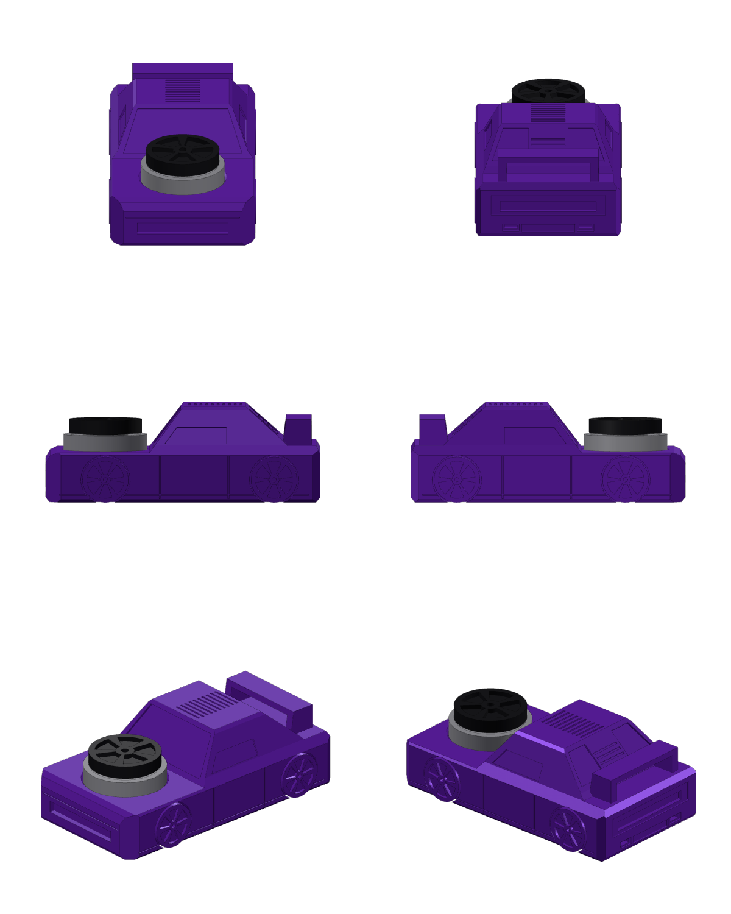

# Auto 608: autko-spinner z łożyskiem 608 na masce

Model autka odtworzony ze zdjęć rzutów (przód, tył, boki, 3/4) z gniazdem na
łożysko **608** (8 × 22 × 7 mm) na masce oraz nakrętką spinnera w kształcie felgi.



## Zawartość

| Ścieżka | Co to jest |
|---|---|
| `fusion360/Auto608/` | **Skrypt Fusion 360**, który buduje model natywnymi operacjami (szkice, wyciągnięcia, parametry) |
| `export/auto_608.step` | Gotowy złożony model (karoseria, nakrętka, łożysko ref.) do importu w Fusion (`File → Open`) |
| `export/auto_608_karoseria.stl` | Karoseria z kołami do druku (jeden element) |
| `export/auto_608_nakretka.stl` | Nakrętka spinnera (druk osobno) |
| `export/_lozysko_608_ref.stl` | Łożysko 608, tylko do podglądu |
| `cadquery_ref/car_608_cq.py` | Ta sama geometria w CadQuery; z niej wygenerowano STEP/STL |
| `docs/porownanie_bok_zdjecie.png` | Krawędzie modelu nałożone na zdjęcie z boku (kontrola proporcji) |

## Uruchomienie w Fusion 360

1. `Utilities → ADD-INS → Scripts and Add-Ins` (lub `Shift+S`).
2. Zakładka **Scripts**, przycisk **+** obok *My Scripts*, wskaż folder `fusion360/Auto608`.
3. Zaznacz **Auto608** i kliknij **Run**. Skrypt otworzy nowy projekt i zbuduje model.

Model jest zbudowany w układzie **Z w górę** (X to długość, przód w X = 0; Y to szerokość;
Z to wysokość). Jeśli masz ustawione *Y up*, auto będzie leżało na boku. Zmienisz to w
`Preferences → General → Default modeling orientation → Z up`.

Po zakończeniu pojawi się komunikat. Jeśli któryś drobny detal (np. fazka, żeberka)
się nie zbudował, będzie wymieniony w ostrzeżeniach, a reszta modelu zostanie.

## Gniazdo łożyska 608

Gniazdo jest nad przednią osią (X = 15,7 mm), w płaskiej masce na wysokości Z = 13 mm.

| Parametr Fusion (`Modify → Change Parameters`) | Domyślnie | Opis |
|---|---|---|
| `lozysko_gniazdo_D` | 22,15 mm | średnica gniazda (22 mm + pasowanie) |
| `lozysko_glebokosc` | 3,0 mm | głębokość gniazda (łożysko wystaje 4 mm) |
| `lozysko_podciecie_D` | 17 mm | podcięcie pod bieżnią wewnętrzną, żeby się nie ocierała |
| `lozysko_podciecie_h` | 1,0 mm | głębokość podcięcia |

Na krawędzi gniazda jest fazka wejściowa 0,5 mm. Do wcisku na drukarce FDM zwykle
sprawdza się 22,10–22,25 mm. Warto najpierw wydrukować próbkę samego gniazda.

Nakrętka spinnera ma trzpień Ø7,95 mm wciskany w bieżnię wewnętrzną łożyska i
dystans Ø11 × 0,5 mm, który dotyka tylko bieżni wewnętrznej, więc nakrętka kręci się
swobodnie.

## Wymiary

* Nadwozie: 72 × 38 × 24,8 mm (z kołami 38,6 mm szerokości).
* Koła: Ø12 × 3,4 mm, rozstaw osi 44,3 mm, felgi z 6 ramionami.
* Szczyt nakrętki: około 21 mm nad podłożem.

Skalę wzięto z łożyska na zdjęciach (Ø22 mm). Stąd długość auta wychodzi około 72 mm.

Wszystkie profile karoserii (bok, góra, przekrój) oraz położenie kół i detali są
stałymi na początku `Auto608.py`. Zmieniasz je i uruchamiasz skrypt ponownie.
Wymiary zmierzono z `docs/porownanie_bok_zdjecie.png`.

## Druk

* **Karoseria:** na spodzie (płaski spód, Z = 0), gniazdem do góry, bez podpór.
  Skrzydło spoilera to most około 22 mm.
* **Nakrętka:** wzorem felgi do stołu, trzpieniem do góry.
* Łożysko wciskasz w gniazdo, a potem nakrętkę w łożysko.

## Regeneracja STEP/STL bez Fusion

```bash
pip install cadquery
python3 cadquery_ref/car_608_cq.py   # zapisuje pliki do export/
```
