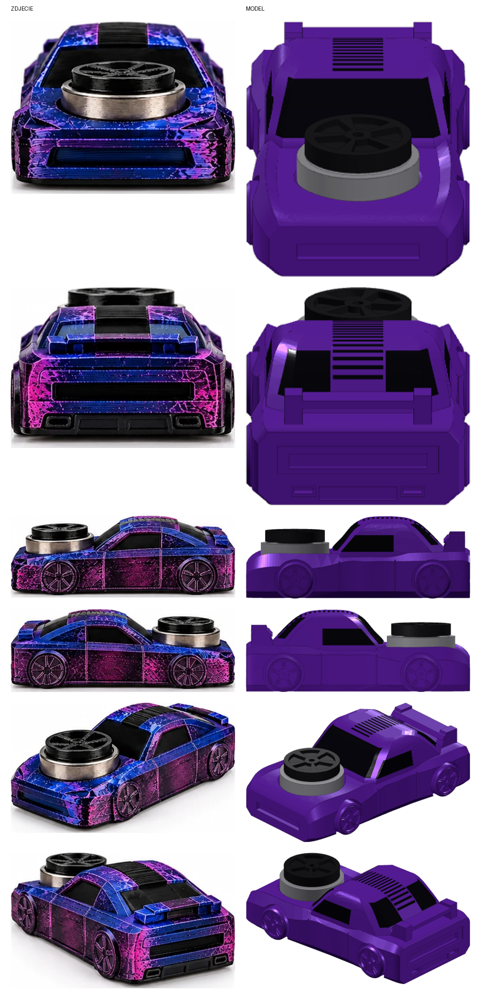
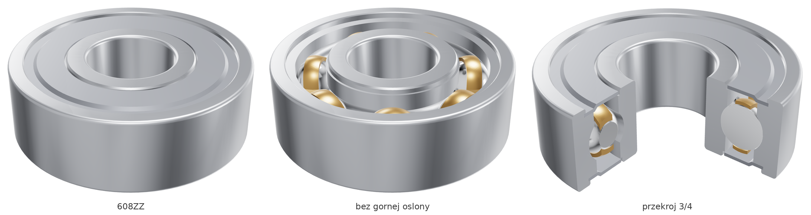
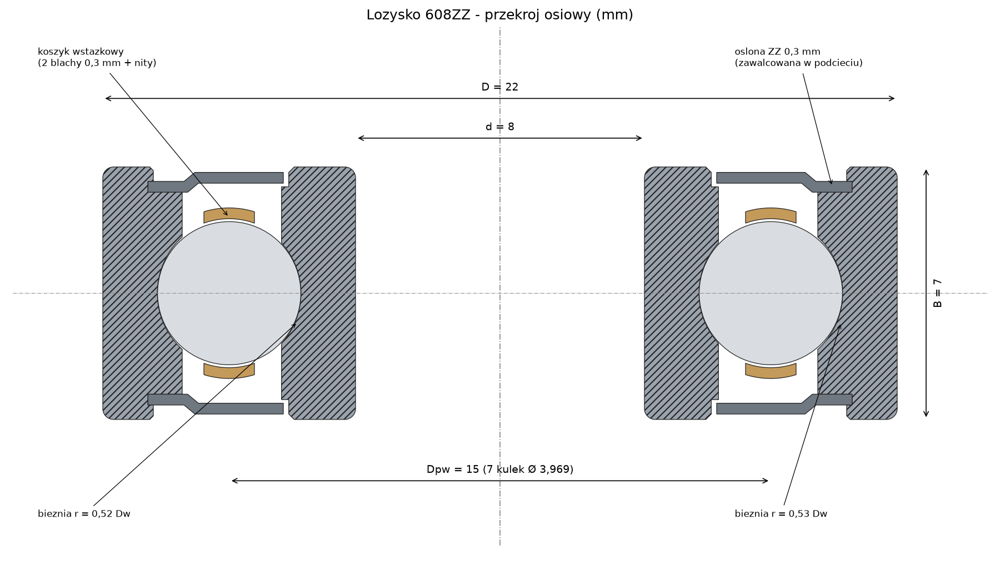
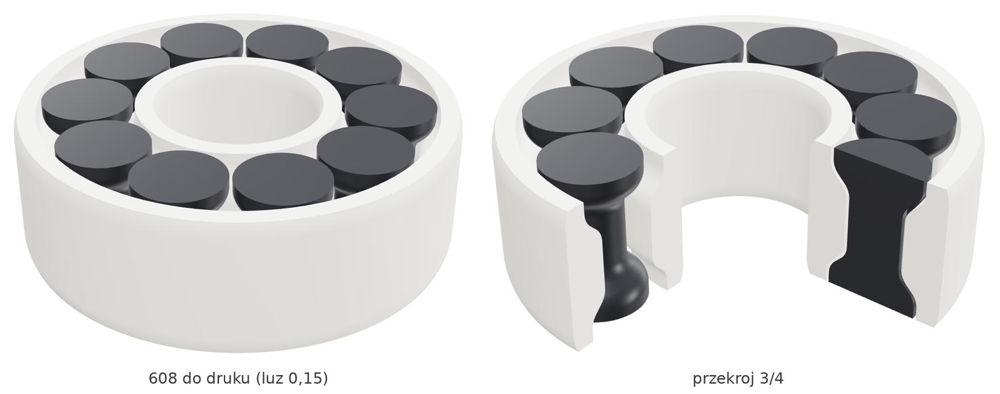
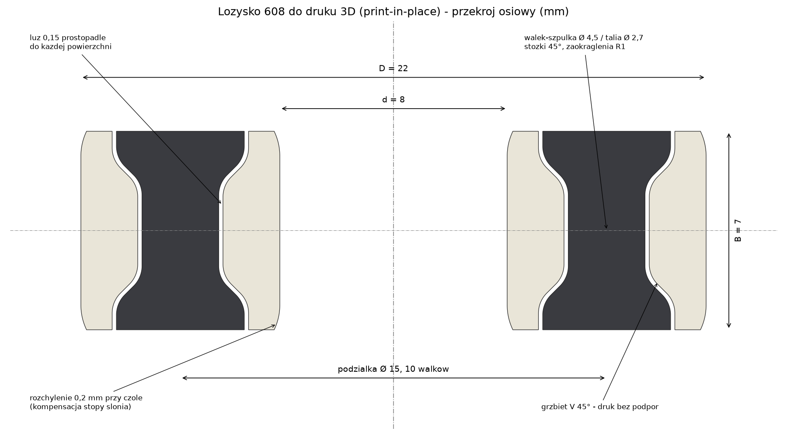

# Auto 608: autko-spinner z łożyskiem 608 na masce

> Osobno w repo są też modele samego łożyska 608:
> [do druku 3D w jednym kawałku](#łożysko-608-do-druku-3d-print-in-place) i
> [szczegółowy model stalowego 608ZZ](#łożysko-608zz-model-szczegółowy).

Model autka odtworzony ze zdjęć rzutów (przód, tył, boki, 3/4) z gniazdem na
łożysko **608** (8 × 22 × 7 mm) na masce oraz nakrętką spinnera w kształcie felgi.


## Zawartość

| Ścieżka | Co to jest |
|---|---|
| `fusion360/Auto608/` | **Skrypt Fusion 360**, który buduje model natywnymi operacjami (szkice, wyciągnięcia, parametry) |
| `export/auto_608.step` | Gotowy złożony model (karoseria, nakrętka, łożysko ref.) do importu w Fusion (`File → Open`) |
| `export/auto_608_karoseria.stl` | Karoseria z kołami do druku (jeden element) |
| `export/auto_608_nakretka.stl` | Nakrętka spinnera (druk osobno) |
| `export/_lozysko_608_ref.stl` | Łożysko 608, tylko do podglądu |
| `cadquery_ref/car_608_cq.py` | Ta sama geometria w CadQuery; z niej wygenerowano STEP/STL |
| `tools/test_fusion_script.py` | Uruchamia skrypt Fusion na atrapie API (`tools/fake_adsk.py`) i porównuje wynik z CadQuery |
| `docs/porownanie_zdjecia_model.png` | Zdjęcia obok renderów modelu z tych samych stron |
| `docs/porownanie_bok_zdjecie.png` | Krawędzie modelu nałożone na zdjęcie z boku (kontrola proporcji) |

## Jak zbudowany jest model

* **Dolna część nadwozia** to loft przez 13 przekrojów poprzecznych: poszerzone błotniki
  nad kołami, węższe drzwi, fazowany bark z przetłoczeniem błotnika, zwężający się przód
  z fazowanymi narożnikami i zaokrąglony tył.
* **Kabina** to loft przez 8 przekrojów poziomych: zaokrąglony dach, pochylona szyba
  przednia i opadający tył (fastback).
* **Szyby i żeberka pasa na dachu** to wgłębienia 0,5 mm w „skórce” kabiny (kabina minus
  kabina wewnętrzna), więc dopasowują się do zaokrągleń.
* **Koła** wystają poza nadwozie w głębokich nadkolach. Felgi mają 5 podwójnych ramion,
  opona jest fazowana.
* **Detale:** spoiler w stylu kaczego ogona z płytkami bocznymi, wlot z przodu, listwa
  świateł, wydechy, dyfuzor i linie drzwi.



## Uruchomienie w Fusion 360

1. `Utilities → ADD-INS → Scripts and Add-Ins` (lub `Shift+S`).
2. Zakładka **Scripts**, przycisk **+** obok *My Scripts*, wskaż folder `fusion360/Auto608`.
3. Zaznacz **Auto608** i kliknij **Run**. Skrypt otworzy nowy projekt i zbuduje model.

Model jest zbudowany w układzie **Z w górę** (X to długość, przód w X = 0; Y to szerokość;
Z to wysokość). Jeśli masz ustawione *Y up*, auto będzie leżało na boku. Zmienisz to w
`Preferences → General → Default modeling orientation → Z up`.

Po zakończeniu pojawi się komunikat. Jeśli któryś drobny detal (np. fazka, żeberka)
się nie zbudował, będzie wymieniony w ostrzeżeniach, a reszta modelu zostanie.

## Gniazdo łożyska 608

Gniazdo jest nad przednią osią (X = 15,7 mm), w płaskiej masce na wysokości Z = 13 mm.

| Parametr Fusion (`Modify → Change Parameters`) | Domyślnie | Opis |
|---|---|---|
| `lozysko_gniazdo_D` | 22,15 mm | średnica gniazda (22 mm + pasowanie) |
| `lozysko_glebokosc` | 3,0 mm | głębokość gniazda (łożysko wystaje 4 mm) |
| `lozysko_podciecie_D` | 17 mm | podcięcie pod bieżnią wewnętrzną, żeby się nie ocierała |
| `lozysko_podciecie_h` | 1,0 mm | głębokość podcięcia |

Na krawędzi gniazda jest fazka wejściowa 0,5 mm. Do wcisku na drukarce FDM zwykle
sprawdza się 22,10–22,25 mm. Warto najpierw wydrukować próbkę samego gniazda.

Nakrętka spinnera ma trzpień Ø7,95 mm wciskany w bieżnię wewnętrzną łożyska i
dystans Ø11 × 0,5 mm, który dotyka tylko bieżni wewnętrznej, więc nakrętka kręci się
swobodnie.

## Wymiary

* Nadwozie: 72 × 38,6 × 25 mm (z kołami 40 mm szerokości).
* Koła: Ø11,6 mm, rozstaw osi 44,3 mm.
* Szczyt nakrętki: około 21 mm nad podłożem.

Skalę wzięto z łożyska na zdjęciach (Ø22 mm). Stąd długość auta wychodzi około 72 mm.

Wszystkie przekroje (`LOWER_KEYS`, `CABIN_KEYS`) oraz położenie kół i detali są stałymi
na początku `Auto608.py`. Zmieniasz je i uruchamiasz skrypt ponownie. Wersja CadQuery
czyta te same stałe z pliku skryptu Fusion, więc obie wersje są zawsze zgodne.
Wymiary zmierzono z `docs/porownanie_bok_zdjecie.png`.

## Druk

* **Karoseria:** na spodzie (płaski spód, Z = 0), gniazdem do góry. Podpory tylko pod
  skrzydłem spoilera (most około 20 mm) i ewentualnie pod górą nadkoli.
* **Nakrętka:** wzorem felgi do stołu, trzpieniem do góry.
* Łożysko wciskasz w gniazdo, a potem nakrętkę w łożysko.

## Regeneracja STEP/STL bez Fusion

```bash
pip install cadquery
python3 cadquery_ref/car_608_cq.py   # zapisuje pliki do export/
python3 tools/test_fusion_script.py  # sprawdza skrypt Fusion (na atrapie API)
```

Test wykonuje prawdziwy kod `Auto608.py` na atrapie API Fusion zbudowanej na CadQuery.
Płaszczyzna XZ ma w atrapie celowo odwróconą orientację. Wynik musi być identyczny z
modelem referencyjnym (różnica objętości 0 mm³). Test sprawdza logikę skryptu (kierunki,
profile, kolejność operacji), ale nie zastępuje uruchomienia w prawdziwym Fusion.

## Łożysko 608ZZ (model szczegółowy)



Pełne złożenie łożyska kulkowego 608ZZ zbudowane natywnymi operacjami Fusion 360
(szkice, obroty, operacje Combine) jako osobne komponenty:

| Komponent | Szt. | Szczegóły |
|---|---|---|
| Pierścień wewnętrzny | 1 | otwór Ø8, bieżnia o promieniu 0,52·Dw, odsadzenie Ø12,1, podcięcia labiryntu pod osłony, zaokrąglenia r 0,3 |
| Pierścień zewnętrzny | 1 | Ø22, bieżnia 0,53·Dw, gniazda osłon Ø19,2 z podcięciem (zawalcowanie), zaokrąglenia r 0,3 |
| Kulka 3,969 (5/32") | 7 | jeden komponent, 7 wystąpień na średnicy podziałowej Ø15 |
| Koszyk | 1 | koszyk wstążkowy: dwie blachy 0,3 mm, kuliste kieszenie (luz 0,08), 7 nitów |
| Osłona ZZ | 2 | blacha 0,3 mm, jeden komponent, dwa wystąpienia |

Wymiary według ISO 15 i katalogu SKF (608-2Z): d = 8, D = 22, B = 7, r_s = 0,3.
Luz promieniowy wynosi 10 µm (klasa CN). Części nie kolidują ze sobą. Masa w stali
wychodzi 12,5 g (katalog: 12 g). Oś łożyska to Z, a środek leży w (0, 0, 0).



| Ścieżka | Co to jest |
|---|---|
| `fusion360/Lozysko608ZZ/` | **Skrypt Fusion 360**, uruchamiany tak samo jak Auto608 (folder `Lozysko608ZZ`) |
| `export/lozysko_608zz.step` | Gotowe złożenie (11 brył, nazwy i kolory) do `File → Open` w Fusion |
| `export/lozysko_608zz.stl` | Całe łożysko jako siatka |
| `cadquery_ref/lozysko_608zz_cq.py` | Ta sama geometria w CadQuery. Z niej generuje się STEP/STL |
| `tools/test_lozysko_608zz.py` | Uruchamia skrypt Fusion na atrapie API i sprawdza zgodność z CadQuery, kolizje, wymiary, luzy i masę |

Po uruchomieniu skryptu wnętrze obejrzysz przez `Inspect → Section Analysis`
na płaszczyźnie XZ albo po ukryciu komponentu *Oslona ZZ*. Wszystkie wymiary
(średnica kulek, luz, promienie bieżni, przekrój osłony, koszyk) to stałe na
początku `Lozysko608ZZ.py`. Wersja CadQuery czyta je z tego samego pliku.

```bash
python3 cadquery_ref/lozysko_608zz_cq.py   # STEP/STL do export/
python3 tools/test_lozysko_608zz.py        # test skryptu Fusion
```

## Łożysko 608 do druku 3D (print-in-place)



Łożysko 608 (8 × 22 × 7) drukowane w całości, bez składania. Zasada działania
jest wzięta z łożyska „一体打印608zz轴承” (Siegfried_Kircheis, MakerWorld). Geometrię
odczytałem z jego pliku 3MF i odbudowałem parametrycznie. Dla luzu 0,15 mm
przekroje zgadzają się z oryginałem z dokładnością do 0,0001 mm.

* **10 wałków w kształcie szpulki** (Ø4,5 na końcach, talia Ø2,7) zamiast kulek i koszyka.
* Na obu pierścieniach są **grzbiety w kształcie litery V** o zboczach 45°, które wchodzą
  w talię wałków. Dzięki temu wałki nie wypadają osiowo. Wszystkie zbocza mają 45°,
  więc łożysko drukuje się bez podpór.
* **Luz jest mierzony prostopadle do każdej powierzchni.** Skrypt pyta o niego przy
  uruchomieniu (0,15 mm dla dobrze skalibrowanej drukarki, 0,20–0,25 mm dla luźniejszej).
* **Otwór i średnica zewnętrzna są rozchylone o 0,2 mm przy czołach**, żeby „stopa słonia”
  nie zmniejszała otworu Ø8 ani nie powiększała średnicy Ø22.



| Ścieżka | Co to jest |
|---|---|
| `fusion360/Lozysko608Druk/` | **Skrypt Fusion 360**. Przy uruchomieniu pyta o luz |
| `export/lozysko_608_druk_luz015.stl` (`020`, `025`) | Gotowe do druku, trzy luzy |
| `export/lozysko_608_druk_luz015.step` | Złożenie STEP (luz 0,15) |
| `cadquery_ref/lozysko_608_druk_cq.py` | Ta sama geometria w CadQuery, eksport STL/STEP |
| `tools/test_lozysko_608_druk.py` | Test skryptu Fusion: zgodność z CadQuery, luzy, kolizje, wymiary |

**Druk** (ustawienia autora oryginału): PLA, warstwa 0,12 mm, 2 obrysy, 15% wypełnienia,
bez podpór, oś pionowo, kompensacja stopy słonia 0,15. Po wydruku przekręć palcem
każdy wałek, żeby go uwolnić. Kropla oleju poprawia obroty. Łożysko pasuje do gniazda
Ø22,15 w masce auta.
