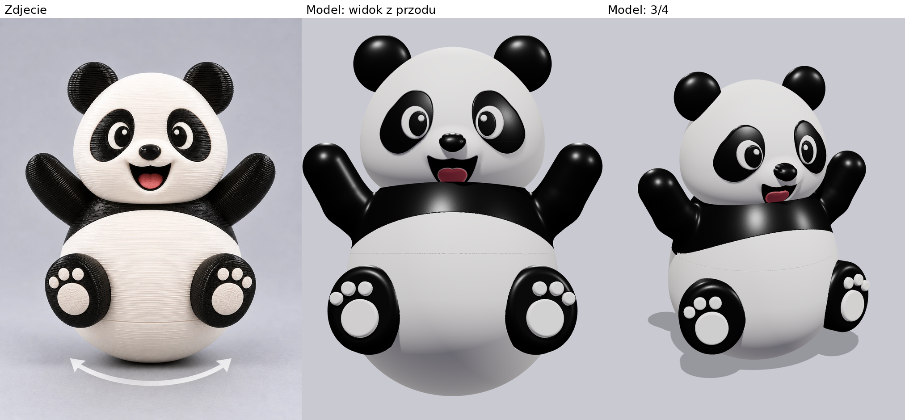
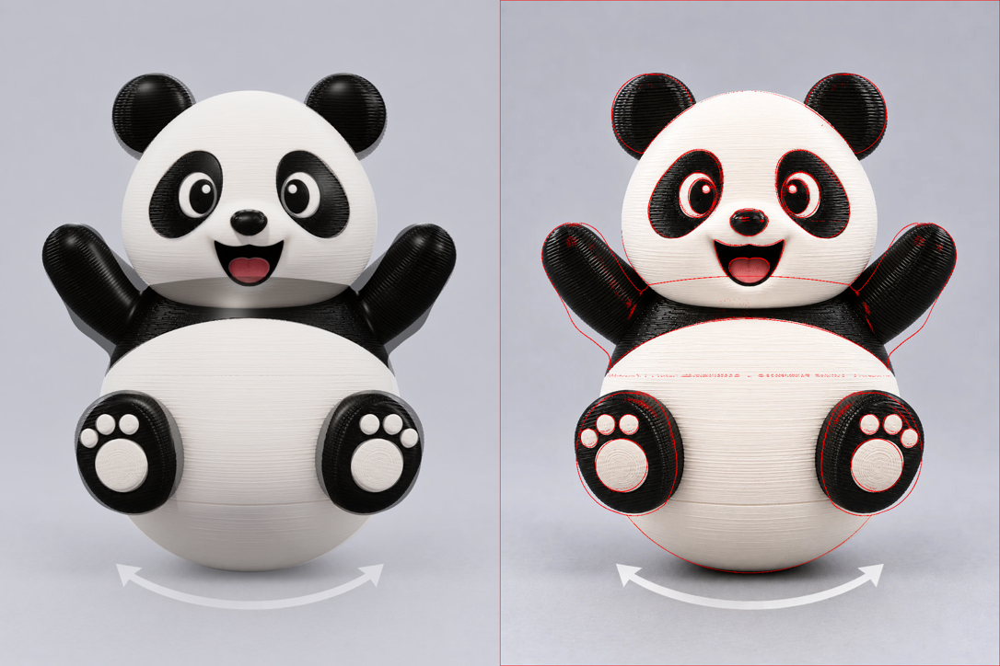
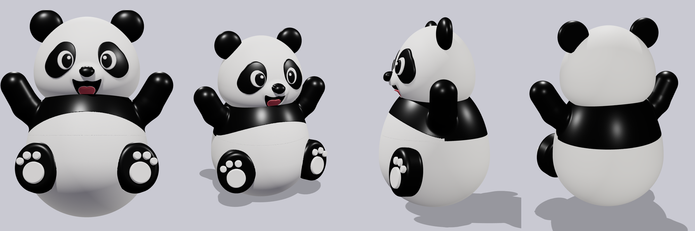
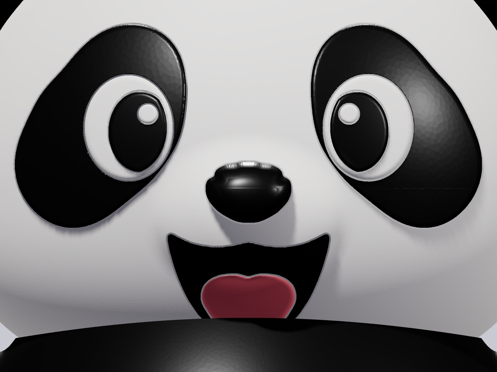
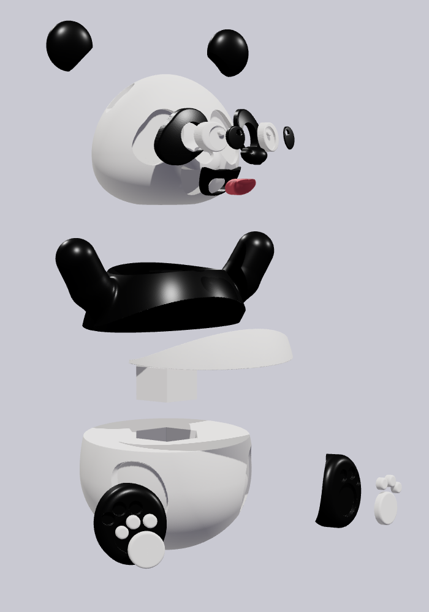
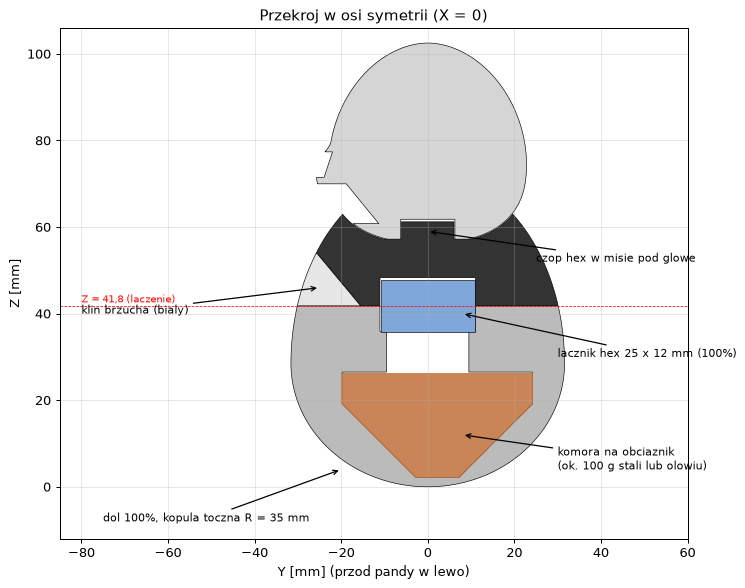

# Panda wanka-wstanka (roly-poly) na Bambu Lab P1S

Panda odwzorowana ze zdjęcia `ref/panda_zdjecie.webp`, zbudowana tak jak nasz Mikołaj
(`Santa_RolyPoly_P1S.3mf`): ciężki dół ze 100% wypełnienia, łącznik sześciokątny, lekki korpus
i głowa oraz kolorowe detale jako osobne jednokolorowe części wklejane w gniazda.



## Zawartość

| Ścieżka | Co to jest |
|---|---|
| `export/Panda_RolyPoly_P1S.3mf` | **Gotowy projekt Bambu Studio**: 3 płyty wg kolorów, części ułożone do druku, ustawienia jak u Mikołaja |
| `panda_rolypoly.py` | Generator geometrii (SDF, siatki, gniazda); zapisuje `export/*.stl` |
| `eksport_3mf.py` | Orientacja do druku, układ płyt i zapis 3MF |
| `stabilnosc.py` | Środek ciężkości złożonej pandy i dobór obciążnika |
| `kontury.py` | Wyciąga kontury łat, nosa, buzi i języka ze zdjęcia (`ref/kontury_mm.json`) |
| `ref/bambu_project_settings.config` | Ustawienia drukarki i filamentów przejęte z projektu Mikołaja |
| `docs/` | Porównanie ze zdjęciem, nakładka konturów, widoki, zbliżenie twarzy, widok rozstrzelony, przekrój |

## Jak odwzorowano zdjęcie

* Skalę wzięto z kuli: szerokość 63,2 mm, jak dół Mikołaja (0,0978 mm/px na zdjęciu).
  Całość ma 106 mm wysokości (bez obciążnika waży ok. 113 g).
* Obrys kuli, głowy, uszu, rąk i stóp dopasowano do sylwetki ze zdjęcia, a łaty, nos, buzię
  i język do konturów wyciągniętych bezpośrednio ze zdjęcia (uśrednionych z odbiciem
  lustrzanym, żeby panda była symetryczna). Oczy, źrenice, blik i poduszki łap zmierzono ze zdjęcia.
* Kontrola: render z przodu nałożony na zdjęcie (czerwone krawędzie modelu):







## Części i płyty

| Płyta | Filament | Części |
|---|---|---|
| 1 | biały | dół 100% (z modyfikatorem 15% w górnym pasie), łącznik hex 100%, głowa, klin brzucha, białka oczu (z blikiem), poduszki łap |
| 2 | czarny | korpus z rękami, uszy, stopy, łaty, źrenice, nos, wnętrze buzi |
| 3 | różowy | język |

Każda płyta jest w jednym kolorze, więc AMS nie jest potrzebny: zmieniasz filament między płytami.

* **Dół**: drukowany do góry nogami (płaską stroną na stół), 100% zig-zag jak u Mikołaja. Pas nad
  równikiem (Z > 29,5 mm) ma modyfikator 15%, bo masa na wysokości środka toczenia nic nie daje.
* **Głowa**: na płaskim spodzie, podpory drzewiaste tylko od stołu (pod zaokrągleniem brody,
  ukryte w misie korpusu). Wypełnienie lightning 15%.
* **Korpus z rękami**: stoi jak w złożeniu i nie potrzebuje podpór (dach klina brzucha ma 50°).
* **Wkładki twarzy**: mają płaskie, pochylone dno i drukują się dnem do stołu. Gniazda są
  wyciągnięte wzdłuż osi Y, więc każdą wkładkę wciskasz prosto od przodu.
* Luzy: 0,15 mm na stronę dla wkładek, 0,25 mm dla gniazd hex (jak u Mikołaja), 0,2 mm między głową a misą.



## Obciążnik: bez niego panda się przewraca

Głowa i ręce pandy są dużo cięższe niż czapka Mikołaja. Sam dół ze 100% nie wystarcza:

| Wariant | Środek ciężkości | Zapas do promienia toczenia (35 mm) |
|---|---|---|
| bez obciążnika | 40 mm | **−5 mm, przewraca się** |
| 100 g śrutu / kulek stalowych (pełna komora) | 28,4–29,9 mm | 5,2–6,6 mm, stoi pionowo (±0,2°) |
| 100 g śrutu ołowianego | 27,0–28,5 mm | 6,6–8,1 mm |
| Mikołaj (dla porównania) | 27,8–29,3 mm | 7–8,6 mm |

Zakresy odpowiadają efektywnemu wypełnieniu korpusu i głowy od 8% do 15% (`python3 stabilnosc.py`).
Przy mniejszej masie panda pochyla się do przodu (60 g stali: 5–8°), bo twarz, stopy i brzuch są z przodu.

W dole jest komora 24,9 cm³ (lejek 45° + walec, przesunięta 2,2 mm do tyłu dla równowagi),
dostępna przez kanał Ø19 pod łącznikiem:



1. Wsyp ok. **100 g** stali (śrut, kulki łożyskowe, drobne nakrętki) albo ołowiu (śrut wędkarski).
2. **Unieruchom** obciążnik: zalej klejem na gorąco, żywicą lub silikonem. Luźny śrut przesypuje się
   przy bujaniu i panda przestaje wstawać.
3. Wklej łącznik hex w gniazdo dołu. Zamyka on kanał.

## Składanie

1. Obciążnik do dołu, zalać, wkleić łącznik hex.
2. Klin brzucha położyć na płaskiej górze dołu (z przodu), nasadzić korpus na łącznik. Korpus
   dosiada klina swoim skośnym spodem. Skleić.
3. Stopy wkleić w płytkie gniazda z przodu dołu, poduszki w gniazda na podeszwach.
4. Twarz: łata, potem białko oka (przez otwór łaty), potem źrenica w gnieździe białka (blik to
   słupek białka wystający przez otwór źrenicy). Nos w gniazdo nad buzią, wnętrze buzi w gniazdo buzi,
   język w otwór wnętrza buzi.
5. Uszy w gniazda na czubku głowy (gniazdo 1,5 mm głębokości ustawia je w miejscu).
6. Głowę nałożyć na sześciokątny czop w misie korpusu i skleić.

## Regeneracja

```bash
pip install numpy scipy scikit-image trimesh manifold3d fast_simplification shapely matplotlib pillow
python3 kontury.py        # (opcjonalnie) kontury ze zdjęcia -> ref/kontury_mm.json
python3 panda_rolypoly.py # siatki -> export/*.stl (ok. 4 min)
python3 eksport_3mf.py    # export/Panda_RolyPoly_P1S.3mf
python3 stabilnosc.py     # środek ciężkości i obciążnik
```

Wszystkie wymiary są stałymi na początku `panda_rolypoly.py`. Układ współrzędnych: X w prawo,
Y do tyłu (panda patrzy w −Y), Z w górę, podłoże Z = 0. Pliki STL nie są w repozytorium
(dublowałyby 3MF), generuje je skrypt.
